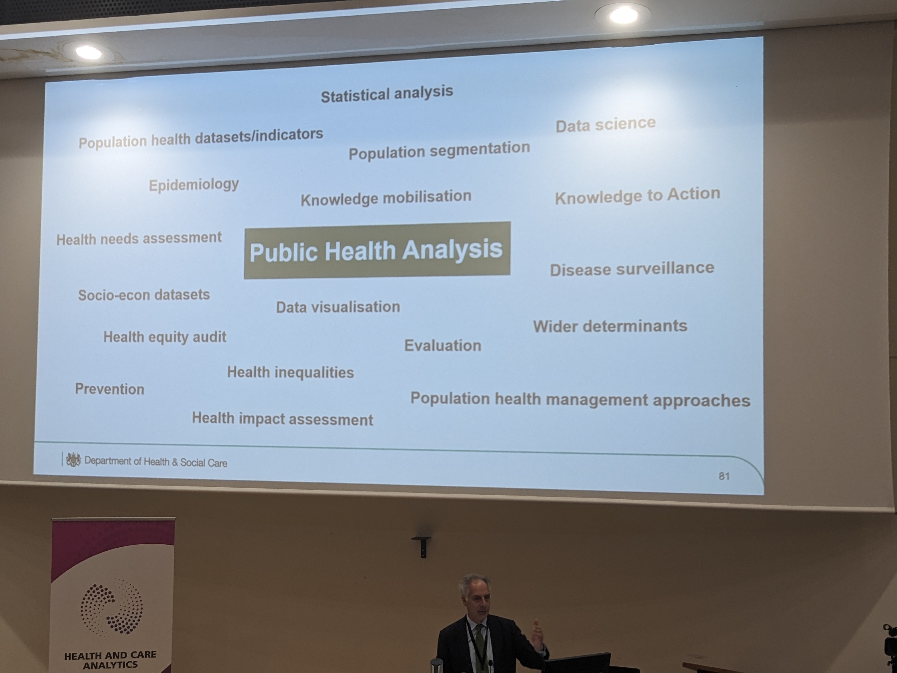
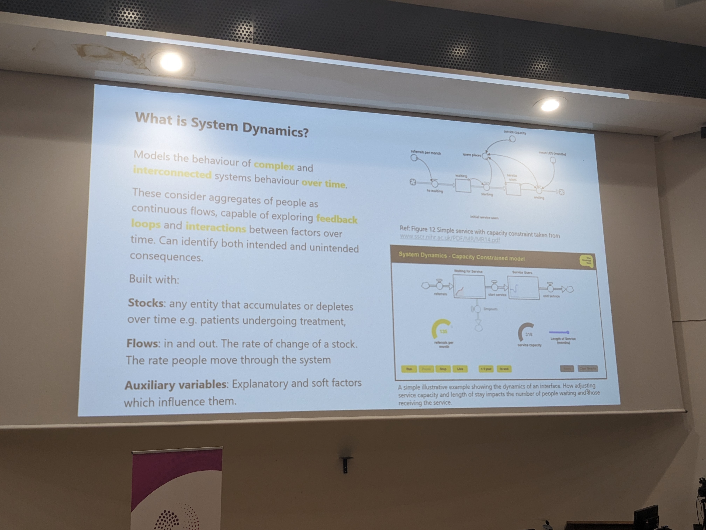
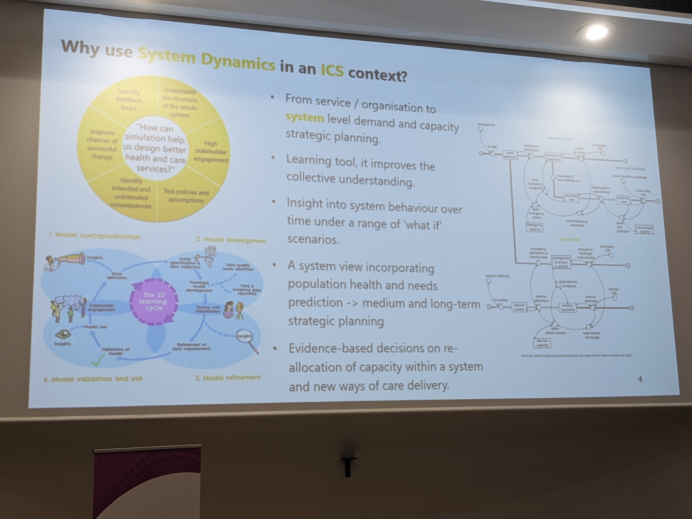
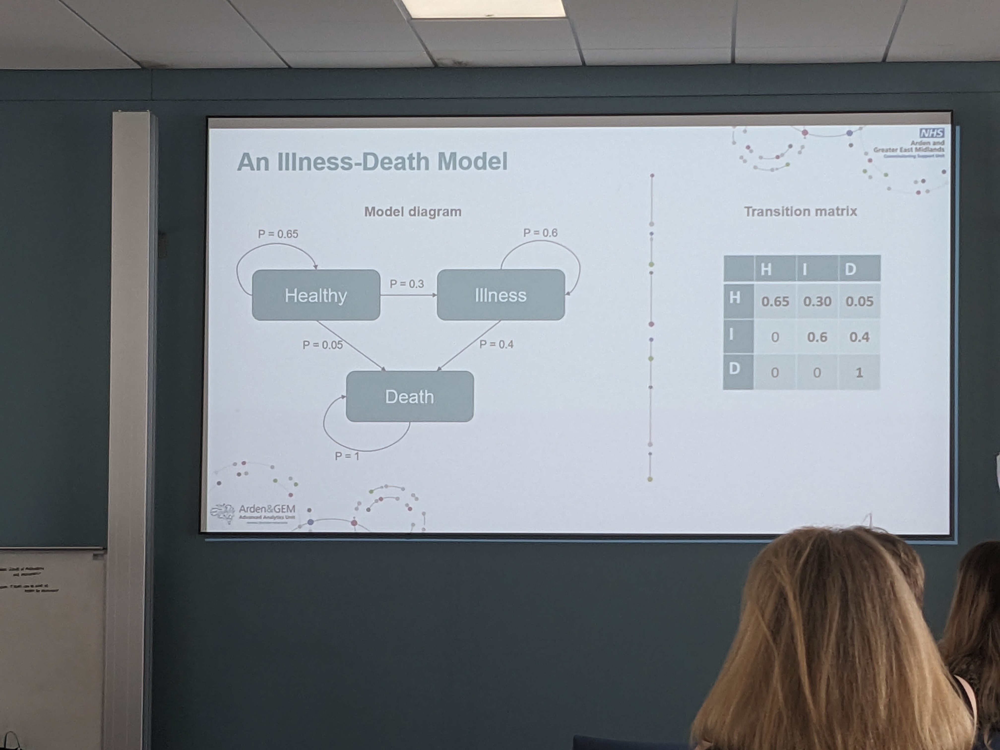

# Peter Spillbury - Opening
Two thoughts from presentations yesterday:  'what was the question that drove the work' and 'who was it for'?  Further thought is what is the decision this should influence?

It is for analytical leaders to step up and force ourselves into the conversation with leaders.

Saw some great work, but led to thoughts about duplication.  No systematic way of sharing it and collaborating at present.  References MDSN, experiment in a collaborative culture. Thinks the  collaborative learning community is the best way to do things, 

# Michale Blastland - On knowing how to run a hospital.
NE|D at Royal Papworth, not about them but raised his interest in it.  He's now curious about all parts of running the org. 'Being ignorant' is not an area of expertise, but it's might actually be useful.  He can ask from a demand perspective, 'this is what I want' from analyst.  He's our customer.

Talked about the idea of 'dark data' with space shuttle launch and 0-rings.  They found no relationship, but they didn't include the 'nothing' happened data.  Changed the interpretation.

Share example of call to ban ibuprofen due to a study suggesting cardiac arrest risk.  He was trying to find data on cardiac arrests.  No clear data, no comprehensive collection, had to go to literature and generalise.

Shared example of breast cancer treatment website. Conveyed risk of treatments well, but there was no data at all on side effects.  Turns out people are very concerned about side effects. This was the 'dark data'. How do we get it?

Went on to talk about the understanding of risk from board reports.  How does he understand the risk of patients in how he priorities.  It's the context element, but this keeps data siloed and unable to interpret if not part of system and unable to see if it's wrong. His RAG rated board report / risk register / doesn't help this.

Gave example of casemix adjustment for mortality.  Deaths went up, but so did predicted, so question is: Why? Caused them to think about acuity and looks like it is increasing.  However, are we using acuity as a way of letting ourselves off the hook for some patients?

# Clare Griffiths and Pouria Hadjibagheri

PHE covid dashboard. Lessons learnt.

+ __Expressions:__ It matters how you say a thing, even if you don't think so.  Example of the phrase fro how many vaccines were given loads of ways to say it, but not all clear.
+ __Accessibility:__ use GDS standards.  Not only for visual impairments, but also thinking about meta data in good when people shared it.  GDS focuses on GDS. Tested visualisations.  Compared two bars, one bar, and a waffles hart.  People like waffle char the least, but when ask to say what it means, waffle chart was the best.
+ __Open data:__ rapid release. Instances where they made mistakes, and were reported by news sites in minutes.  Allowed people to see and highlight errors. Treated people looking for their errors or with unfounded theories as just other groups of users who helped develop the system.

Are we at risk of asking the wrong question in our quest for 'the dashboard?'
Pouria:  Yes we are!  Bloomberg said it looked nice, but that's not the point, is it?  There's a goal in communications to no raise the wrath of Daily Mail etc.  If we focus fully on how it looks rather than what it is doing, with a good data model, good metadata about data provenance or changes.  When designing a national service.  Tested the interaction with the site, nice visualisation and overlayed on heatmap.  Saw where people were going with clicks, and particularity where people thought they would go for more.
Pipeline was 26+ sources, ~700 million raw figures ~10 million figures by the end. ETL: ~50 million.
Main database ~400 million, 250 million with age, 14 million with age.
Planned for the big swing in users every day at 4 p.m.  It goes beyond the aesthetics, it goes with service planning and timeline for lines. Planned that the ETL stage would only ever receive anonymised, aggregated data so there was not prospect of leak.
__User-centred design is key, iterative improvement , kill it off once it is finished, and learn lessons from it__

# John Newton - Birector of public halth anaysis at OHID
## Why we need a strong Public Helath Intelligence Function

NHS75 round-table discussion cam with authorities. : prevention, strength primary care, use data better.
Get the slide on public health approach:

Understand the problem at population level, look at what's driving it as part of complex system, collating data and evidence, being prevention focused, protecting and promoting health and well-being, multi-agency partnership, and inequalities, social justice and human right.

OHID: drive policy across government of PH, delivering national programmes for improved PH and reduce disparities, support NHS and Local government with delivery of local PH interventions. Strategic direction of PH workforces including analytic, surveillance and monitoring of PH.

Talked about tools, and highlighted fingertips, the health profiles for England (originally for local areas, but the national level view has been very helpful). Excess mortality tools. Covid-19 dashboard referenced again.  __Gloabl burden of disease tool:  check this__

Referenced Knowledge to action cycle (K2A).

Random thought: PCA of health profile data.  Urban or rural, deprivation, London or not were highly predictive of all the others.  Did a very good job of standardising.

Survival methods on waiting lists: Cox ph on waiting list? Confidence intervals. __try this__

# Janine Dellar and Dave Kirk
## Building a whole suystem model for 5 year forwardview

u more of a conceptual model to what they want to see in the various parts of the system.
Led to question fo 'can you do this for a whole system, for finance, performance, and workforces etc.?  Their answer was: Nope!  Some good data, some of the things they want weren't collected, did they have the skill set to do it in the ICB: nope.  Did they have people read to receive that model?  Nope, and it needed doing in a month.
Started with a rate adjustment model: covers major activity elements, demographics, and adjust schemes based on places. Simple enough to use, transparent etc.  
Change in approach - PHM.  Needs asessment, opportunity analysis, impactability modelling.
Doing things lice absolute change in LTC registers. 
Using CVD as started as evidence and data are good.  Have a casefinding tool too.  6.1% spells, £46 million spend (10.7 of total IP cost), nearly 100,000 beddays.
PHE return on investment in CVD tool used, improving detection and management of hypotension to 80%, could prevent 1000 CVD events in 5 years, estimated 61 deaths., huge savings ~10 million.
_contact_

# Steve Wyatt - comparing needs-adjusted supply of GP practise consultations
Three types of study on consultation rates: patient recall studies, research database extracts, routinely reproted appointments at NHSD.  6 well established primary care databases, vendor specific.
Check emma vestessions 2023 paper on consultations, using CPRD AURUM. NHSD appointment data also available.  Big gap between 2021 - 20-16.  Study definitions as not clear and 
Need a single study across whole time period that works across all.  Steve used CPRD Gold and CPRD Aurum to do this.
Drawing samples of year stratified, exposure weighted random samples 20,00 per year.  
`Consultations ~year*sex (|practise) + log(exposre).  Negbin model.` mixed effects model.
Suggest (from crude rates) that consultation rate has not kept pace with population growth.  GP population has been fairly static, other professionals in GPs increase, but GPs still main, 

# Martina FOnseca
## DES for ambulance waits and emergency 

In context of ambulance to emergency department handover deals and elevated ambulance response times, can a tool be developed to help understand what happens to:
+ Response times by category,
+ Handover delays
+ Availability
If we increase the number of vehicle hours (supply) within system#Affect other factor like model of care, job cycle time components, operate under different levels of strain.
Used simmer for DES in R.
__Looks excellent. Contact Martina about it__ Really rational, well designed, visualised.  Shifting the curve approach is great.

https://github.com/nhsengland/AmbModelOpen

# Andrew JOnes - The Strategey Unit
## Rapid growth of diagnostic testing is increasing A&E waiting times.
Testing in A&E has doubled in the last 10 years.  Patients are also generally sicker, so was case-mix adjusted here.  There is a trade-off with testing here, in that it helps the diagnosis and treatment plan but it has wider implication on the patient and the complex health system we are part of.
Estimated that about 10% of test are unnecessary, __Is this because not it, or no prospect of illness? Patient reassurance?__
Some test reduce the stay in A&E such are cardiac enzymes, but most common add time, CT ~58 mins, biochemc / heam ~70, MRI ~70, x-ray~20.  Seems to be responsible to 300,000 breaches?
Trade-off curve of diagnostic certainty and number test / time in A&E was very good. Longer wait/more test, more certainty, but where is tipping point? Not just for individual patient, as they all take the A&E department resources, so giving to one limits ability to give to others.

# Lizi Johnstone and Jane Kirkpatrick NHSE -
## Forecasting emergency dpeartment admissions for operational decision support in the NHS
Context is need for elective recovery and demand uncertainty around emergency admissions.
21-day emergency admission forecast. Done with FacultyAI.
Bayesian Hierarchical model for timeseries.  Includes weekly seasonality and code online.

# Kelly Bishop & Andy McCann
## A review of the impact of the Covid pandemic on the provision of urgent and emergency care across hospitals in the Northwest of England

Interesting engagement with different departments.  Made a good point about creeping normalisation of long waits and corridor care.  Context was helpful to say that occupancy in A&E attendance lower than was before covid, so why are people on trolleys, is it about time spent in A&E.

# Stacy Croft
## System dynamics

SD overview slide is really good __Pick this up__

Strategy Unit is coordinating a programme of online training for it.  __How doe we access it?__

Douglass McKelvie wrote a book on it, and it's very good. Find this.
Project examples: future demand of care homes, cancer 2 week pathway, IAPT access.

# Thomas Nicholas, East London NHS Foundation Trust
## How to introduce self-service Statistical Process Control at an industrial scale in an NHS Trust
Good case for applying SPC.  __Should we invite Tom to present this at our meetings?__

# Sam Hollins
## SHMI improvement 

Train / test split not included.  Class imbalanced datasets. Scored mechanism ROC. Didn't perform very well over some of the conditions.  Primary diagnosis model not good for the current.
Change as little as possible and get most benefit.
Recommended LASSO with CCS groups as c-morbidities.

# Simon Welesley-MIller - 
## Health inequaliteis on waiting lists
__Get his presentation, as it's cool.__  Different waiting lists across different specialities and providers.  What is a health inequality if a big question.   Correlation issue: you've got sick people on the waiting list' which is where you want them to be.
Did some work about distribution tests across waiting lists.  This is his MSc project.
Seems that people waiting on the list for a longer time have better completeness.  This affects this sort of analysis as a confounder.
Taken a clustering approach and then pooled them to work out things like: 'elderly white males who smoke'. Clustering selects most important features here, different from one ICB to the next.
Is this published and national available?  

# Adrian Pratt
## The years of life lost to common multimorbidity combinations: An application of Markov models to the NHS Bridges to Health National Segmentation Dataset
MArkov model is a transitional state model according to probabilistic rules.  States are exhaustive and mutually exclusive.

Consider a simple death illness model:

You can combine to transition matrices e.g. Age 1-3, age 2,3 to age 1-3 Combine is a matrix multiplication by all entries.

FY19/20 33 illnesses ignore the frailty indicators. Presence of two or more conditions as definition.
Calculate the combine matrix and any combinations of factors can be calculated from the model.  Nice point about life expectancy, as it depends on your age.  E.g. at birth it might be 84, but tell and 89 year-old that, they would still have a few years.
The matricies of life expectancy based on combinations to two conditions is brilliant.  __Can we use this and fit to NCL?__  Needs high frequency, high volume person-level data, model doesn't account for history (markov property), but get to say what is future life expectancy with those conditions.

No primary care data, but this would be hard to include given current reporting style? No years of life lost calculation.
Arden and GEM and NHSE, would b good to get access if possible.

# Chris B
# CLosing statements

